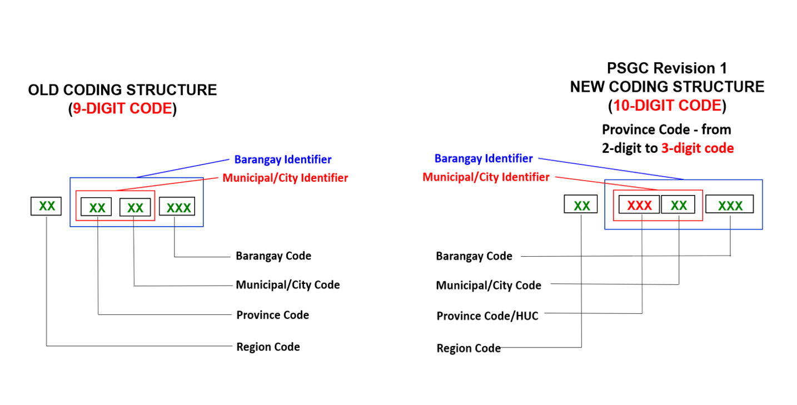
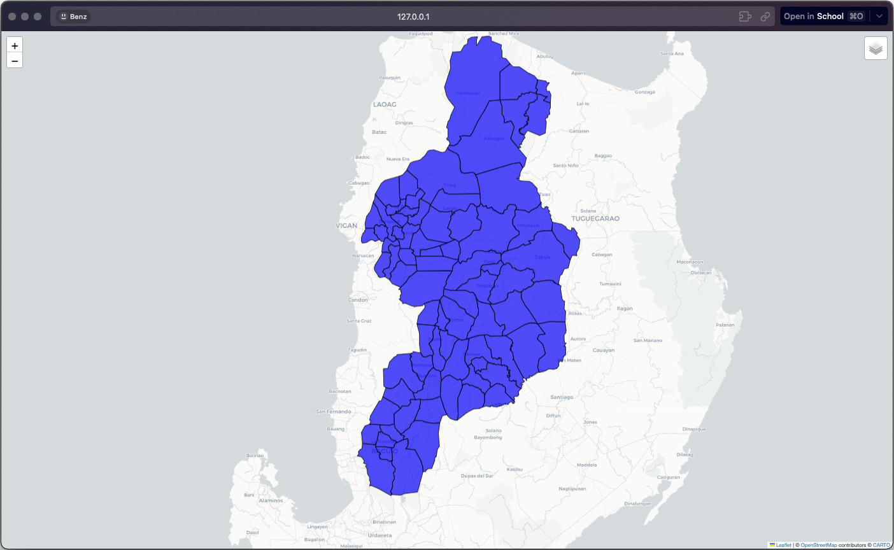

# Cordillera Administrative Region (CAR) Map Visualization

## Data Source
The dataset is acquired from: [Philippines PSGC Shapefiles](https://github.com/altcoder/philippines-psgc-shapefiles)

Specifically from the [Municities](https://github.com/altcoder/philippines-psgc-shapefiles/blob/main/data/2023/Municities/phl_admbnda_adm3_psa_namria_20231106.shp) dataset which contains shapefiles of all municipalities and cities in the Philippines.

## About the Philippine Standard Geographic Code (PSGC)
The PSGC is a coding scheme of geographic areas in the Philippines. 

## Map Generation Process

This visualization focuses on municipalities in the Cordillera Administrative Region (CAR) with PSGC codes starting with "14":

1. **Data Preparation**:
   - Loaded municipal shapefiles
   - Filtered for CAR region (PSGC: 14*)
   - Converted to GeoJSON (reducing file size from 1642 to 77 features)

2. **Spatial Processing**:
   - Projected to Web Mercator (EPSG:3857) for accurate centroid calculation
   - Calculated region center using geometry centroids
   - Converted back to WGS84 (EPSG:4326) for web mapping compatibility

3. **Map Creation using Folium**:
   - Built interactive Folium map centered on CAR
   - Used CartoDB positron basemap for clean visualization
   - Applied blue styling with black borders for municipalities
   - Added municipality name tooltips for user interaction
   - Incorporated layer controls for enhanced usability

4. **Output**:
   - Saved as interactive "CAR_map.html"
   

## Notes
- The original shapefile is excluded from the repository due to size constraints
- Only the processed geojson is saved, however we can generate a new file based on requirement changes.

## TO DO
- Adding language/dialect population data from external databases
- Implementing a color gradient based on linguistic or demographic data
- Adding more interactive features and detailed information panels